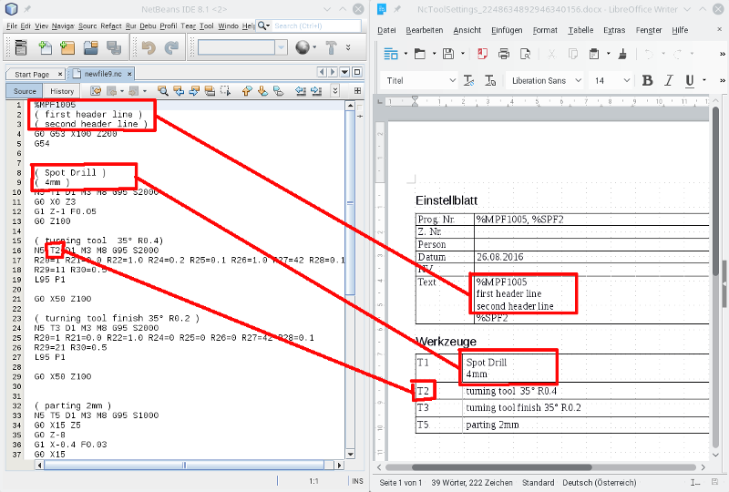

# MachineToolConfSheet

Creata a Machine Tool Configuration Sheet from G-Code file and open it in [LibreOffice](https://www.libreoffice.org/).

# Installation

* Requires [LibreOffice](https://www.libreoffice.org/)
* Download from: http://plugins.netbeans.org/
* Go to "Tools" -> "Plugins" -> "Downloaded", click "Add Plugins..." and select the downloaded file org-roiderh-machinetoolconfsheet.nbm
* Check the Checkbox and click "Install"

# Usage

Open a G-Code file and click the toolbar button: .
LibreOffice opens the new Machine Tool Configuration Sheet.

A screenshot:

